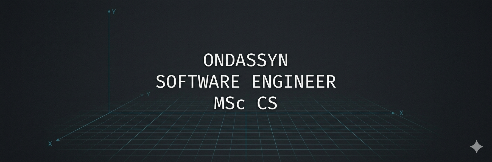

# Ondassyn Abdrakhmanov
**Software Engineer (MSc) | Interactive UI & Real-Time Systems**

Experienced developer specializing in high-performance web applications and interactive user experiences. 5+ years of expertise in EdTech, scaling systems for 40+ organizations.

### ⚡ Technical Focus
* **Core:** React 19, Next.js 16 (App Router), TypeScript 5.
* **UX/UI:** Motion Design (Framer Motion), Tailwind CSS 4.0, Pixel-perfect implementation.
* **Systems:** Distributed systems architecture, Real-time data (Firebase), MongoDB.

---

### 🧪 Engineering Lab (Featured Projects)

#### 1. [Real-Time Quiz Engine](https://github.com/Ondassyn/jeoejo_firebase)
> **The Challenge:** Sub-second state synchronization for live competitive environments.
> * **Tech:** Next.js 15, Firebase Realtime DB, Framer Motion.
> * **Highlight:** Engineered a "Game Show" interface with synchronized auto-locking timers and dynamic media reveal (MP4/Static) to ensure competitive integrity across all clients.
> * 🔗 [**Live Demo**](https://jeojeo-hazel.vercel.app/) | [**Technical Deep-Dive**](https://github.com/Ondassyn/jeojeo_firebase#-core-features)

#### 2. [Spy Game: Who Is Lying?](https://github.com/Ondassyn/who_is_lying)
> **The Challenge:** Managing asymmetric information distribution in a multi-user environment.
> * **Tech:** React 19, Next.js 16, Firebase, MongoDB.
> * **Highlight:** Implemented a real-time "Information Symmetry Breaking" engine. It selectively pushes different data strings (Questions) to specific users while maintaining a unified UI state for all other participants.
> * 🔗 [**Live Demo**](https://who-is-lying.vercel.app/) | [**Technical Highlights**](https://github.com/Ondassyn/who_is_lying#-technical-highlights)

#### 3. [Fincher Tribute UI](https://github.com/Ondassyn/davidfincher)
> **The Challenge:** High-fidelity cinematic storytelling through custom browser interactions.
> * **Tech:** React, Custom Scroll Math, Parallax CSS.
> * **Highlight:** Developed a custom animation engine for scroll-triggered transitions and parallax effects, optimized for 60fps performance on mobile and desktop.
> * 🔗 [**Live Demo**](https://davidfincher.vercel.app/) | [**Engineering Highlights**](https://github.com/Ondassyn/davidfincher#-engineering-highlights)

---

### 🛠️ Toolbelt
| Category | Stack |
| :--- | :--- |
| **Frontend** | React 19, Next.js 16, TypeScript, Tailwind 4 |
| **Backend/DB** | Firebase Realtime DB, MongoDB, Node.js |
| **Motion** | Framer Motion (Motion 12), GSAP, CSS Math |
| **Quality** | ESLint 9, TypeScript Strict Mode |

---

### 📈 Connect & Collaborate
* 💼 [LinkedIn](https://linkedin.com/in/ondassyn-abdrakhmanov)
* 📧 [Email Me](mailto:oabdrakhmanov@alumni.nu.edu.kz)
* 📍 Astana, Kazakhstan
